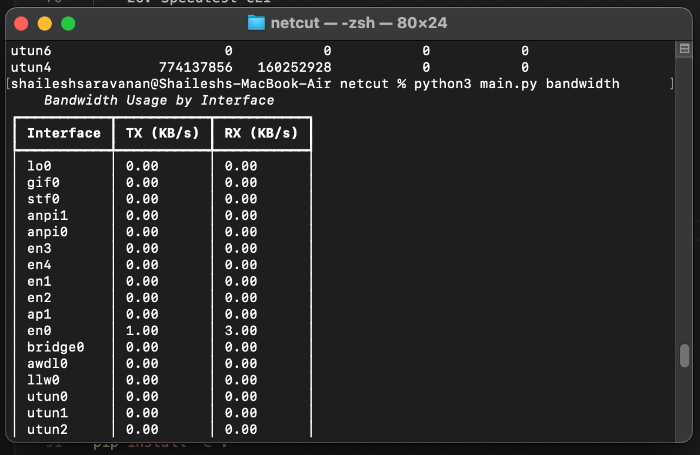
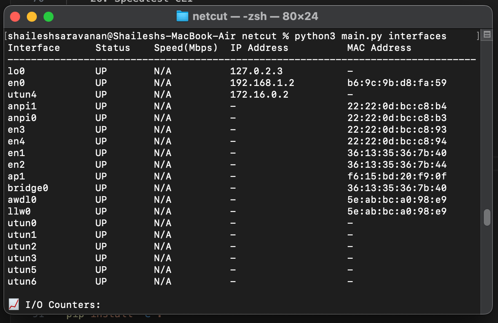

# 🧠 Netcut

**Netcut** is a powerful all-in-one **terminal-based network toolkit** designed for diagnostics, analytics, reconnaissance, and debugging. From uptime analytics to wireless scanning, Netcut brings around 25 features in one unified CLI interface.

---

## 🚀 Features at a Glance

### 🧠 Core Networking Tools
- **Downtime Analytics Dashboard** — Show uptime %, longest downtime, mean response time  
  `netcut stats`
- **Geo-IP Tracking** — Lookup host’s geographic location  
  `netcut geo <host>`
- **ICMP Ping & TCP Port Check** — Ping with ICMP or check TCP port  
  `netcut check <host>`
- **Multi-Protocol Support** — ICMP fallback, TCP checks for HTTP/SSH, etc.
- **Status Page Generator** — Export static HTML with service status  
  `netcut statuspage`
- **Status Checker Loop** — Continuously check URL status and uptime in terminal  netcut statuspage <url>

### 📈 Monitoring & Analysis
- **Bandwidth Usage Monitor** — Show live per-process bandwidth  
  `netcut bandwidth`
- **Packet Sniffer** — Live packet analyzer with filters  
  `netcut sniffer --port 80`
- **Port Scanner** — Fast or deep TCP/UDP scans  
  `netcut scan <host>`
- **ARP Table Viewer & Spoof Detection** — Detect MAC duplicates  
  `netcut arp`, `netcut mitm-detect`
- **Firewall Rule Lister/Editor** — List/add/remove iptables/UFW rules  
  `netcut firewall`
- **Network Interface Stats** — Show IP, MAC, RX/TX bytes, errors  
  `netcut interfaces`

### 🌐 Internet & Web Tools
- **SSL Certificate Viewer** — Show cert chain, issuer, expiry  
  `netcut ssl <host>`
- **Subdomain Enumerator** — Find subdomains using certificate transparency logs  
  `netcut subdomains <domain>`
- **CDN Detection** — Identify Cloudflare, Akamai, etc.  
  `netcut cdn <domain>`
- **Website Technology Fingerprinter** — Detect stack: CMS, web server, JS libs  
  `netcut tech <url>`
- **API Latency & Auth Monitor** — Test protected endpoints, uptime, latency  
  `netcut api <url>`

### 📡 Wireless & Local Network
- **WiFi Signal Heatmap** — Show current nearby WiFi SSIDs (macOS: from known or preferred networks)  
  `netcut wifi`
- **Bluetooth Device Scanner** — Detect nearby or paired Bluetooth devices (macOS uses blueutil)  
  `netcut bt`
- **DHCP Lease Viewer** — Parse local DHCP leases  
  `netcut dhcp`
- **LAN Service Discovery** — mDNS/Bonjour discovery  
  `netcut lan`

### ⚙️ Security & Debugging
- **Proxy Checker** — Test HTTP/SOCKS proxies and show IP or fallback text on failure  
  `netcut proxy <proxy_url>`
- **DNS Leak Test** — Reveal actual DNS servers used  
  `netcut dnsleak`
- **Traceroute Visualizer** — ASCII tree showing hops/latency  
  `netcut traceroute <host>`
- **MITM Detection** — Detect ARP spoofing and MAC conflicts  
  `netcut mitm-detect`
- **VPN Tunnel Leak Detection** — Compare IP, DNS routes to detect leaks  
  `netcut tunnel-check`

### 🚀 Utility & Extensions
- **Speedtest CLI** — Measure download, upload, ping  
  `netcut speedtest`
- **Reachability Tester** — Batch check multiple URLs  
  `netcut reachability <file.txt>`
- **WHOIS Lookup** — Domain registrar, expiration info  
  `netcut whois <domain>`

---

## 🖥️ Demo

### speedtest


### bandwidth


### interfaces


---

## 🔧 Installation

```bash
git clone https://github.com/shaileshsaravanan/netcut.git
cd netcut

# Option 1: Install via wheel (recommended)
python3 -m build
pip install dist/netcut-*.whl

# Option 2: Install in editable mode (for development)
pip install -r requirements.txt
pip install -e .
```

✅ After installing, use it from anywhere:

```bash
netcut stats
netcut geo google.com
netcut reachability targets.txt
```

⸻

📦 CLI Usage

General CLI Help

netcut --help

Common Commands

| Command                            | Description                                 |
|------------------------------------|---------------------------------------------|
| `netcut stats`                     | Show uptime, downtime, response time        |
| `netcut geo <host>`                | Lookup IP geolocation                       |
| `netcut check <host>`              | ICMP/TCP ping to check host                 |
| `netcut scan <host>`               | TCP/UDP port scan                           |
| `netcut firewall --list`           | Show current firewall rules                 |
| `netcut ssl <host>`                | Show SSL certificate info                   |
| `netcut wifi`                      | Show nearby WiFi SSIDs (macOS: preferred networks) |
| `netcut api <url>`                 | Test API with headers/auth                  |
| `netcut traceroute <host>`         | Show ASCII hop map                          |
| `netcut mitm-detect`              | Detect ARP/MAC spoofing (MITM)              |
| `netcut reachability <file>`       | Check multiple URLs from file               |
| `netcut whois <domain>`            | Perform WHOIS lookup                        |
| `netcut bt`                       | Scan nearby/paired Bluetooth devices        |
| `netcut proxy <proxy_url>`        | Check proxy functionality and show resolved IP |
| `netcut subdomains <domain>`      | Find subdomains via cert transparency logs  |
| `netcut statuspage <url>`         | Continuously check and log URL availability |

See the full command list by running netcut --help.

⸻

📁 targets.txt Example

https://google.com
https://github.com
https://api.example.com/health

Use:

netcut reachability targets.txt


⸻

💻 Supported Platforms
	•	✅ Linux (Debian/Ubuntu/Arch)
	•	✅ macOS
	•	🧪 WSL (some features limited)