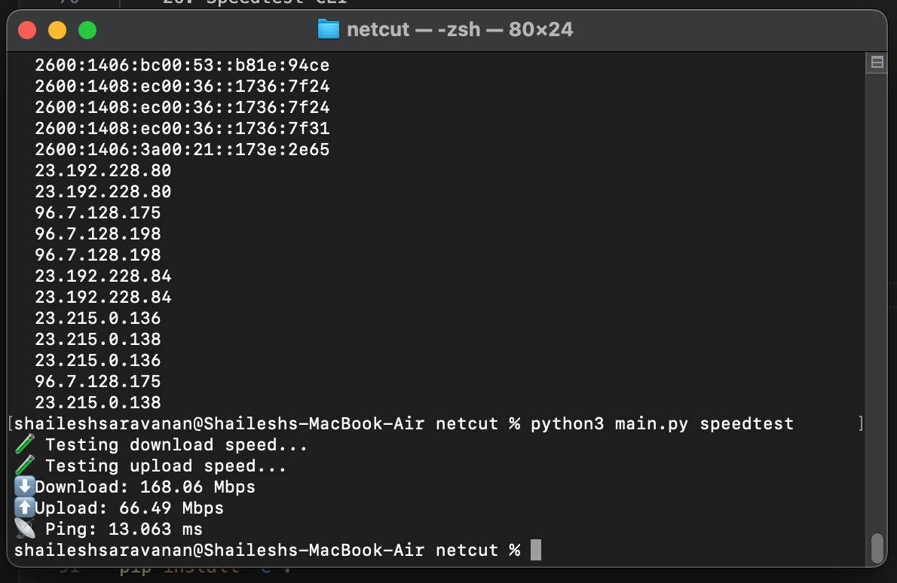

# 🧠 Netcut

**Netcut** is a powerful all-in-one **terminal-based network toolkit** designed for diagnostics, analytics, reconnaissance, and debugging. From uptime analytics to wireless scanning, Netcut brings around 25 features in one unified CLI interface.

---

## 🚀 Features at a Glance

🧠 Core Networking Tools
	1.	Downtime Analytics Dashboard
Show uptime %, longest downtime, mean response time (CLI: netcut stats)
	2.	Geo-IP Tracking
Lookup host’s geographic location (CLI: netcut geo <host>)
	3.	ICMP Ping & TCP Port Check
Ping with ICMP or check TCP port (CLI: netcut check <host>)
	4.	Multi-Protocol Support
ICMP fallback, TCP port checks for HTTP/SSH etc.
	5.	Status Page Generator
Export static HTML with service status (CLI: netcut statuspage)

📈 Monitoring & Analysis
	6.	Bandwidth Usage Monitor
Show live per-process bandwidth (CLI: netcut bandwidth)
	7.	Packet Sniffer
Live packet analyzer with filters (CLI: netcut sniffer --port 80)
	8.	Port Scanner
Fast or deep TCP/UDP scans (CLI: netcut scan <host>)
	9.	ARP Table Viewer & Spoof Detection
Detect MAC duplicates (CLI: netcut arp, netcut mitm-detect)
	10.	Firewall Rule Lister/Editor
List/add/remove iptables or UFW rules (CLI: netcut firewall)
	11.	Network Interface Stats
Show IP, MAC, RX/TX bytes, errors (CLI: netcut interfaces)

🌐 Internet & Web Tools
	12.	SSL Certificate Viewer
Show cert chain, issuer, expiry (CLI: netcut ssl <host>)
	13.	Subdomain Enumerator
Find valid subdomains via wordlist (CLI: netcut subdomains <domain>)
	14.	CDN Detection
Identify Cloudflare, Akamai, etc. (CLI: netcut cdn <domain>)
	15.	Website Technology Fingerprinter
Detect stack: CMS, web server, JS libs (CLI: netcut tech <url>)
	16.	API Latency & Auth Monitor
Test protected endpoints, uptime, latency (CLI: netcut api <url>)

📡 Wireless & Local Network
	17.	WiFi Signal Heatmap Export
Export signal data to CSV/JSON (CLI: netcut wifi)
	18.	Bluetooth Device Scanner
Detect nearby BT devices (CLI: netcut bt)
	19.	DHCP Lease Viewer
Parse local DHCP leases (CLI: netcut dhcp)
	20.	LAN Service Discovery
mDNS/Bonjour discovery (CLI: netcut lan)

⚙️ Security & Debugging
	21.	Proxy Checker
Test HTTP/SOCKS proxies (CLI: netcut proxy <proxy_url>)
	22.	DNS Leak Test
Reveal actual DNS servers used (CLI: netcut dnsleak)
	23.	Traceroute Visualizer
ASCII tree showing hops/latency (CLI: netcut traceroute <host>)
	24.	MITM Detection
Detect ARP spoofing and MAC conflicts (CLI: netcut mitm-detect)
	25.	VPN Tunnel Leak Detection
Compare IP, DNS routes to detect leaks (CLI: netcut tunnel-check)

🚀 Utility & Extensions
	26.	Speedtest CLI
Measure download, upload, ping (CLI: netcut speedtest)
	27.	Reachability Tester
Batch check multiple URLs (CLI: netcut reachability <file.txt>)
	28.	WHOIS Lookup
Domain registrar, expiration info (CLI: netcut whois <domain>)

---

## 🖥️ Demo

### speedtest


### bandwidth


### interfaces


---

## 🔧 Installation

```bash
git clone https://github.com/yourname/netcut
cd netcut
pip install -r requirements.txt
pip install -e .
```

✅ After install, use from anywhere:

```bash
netcut stats
netcut geo google.com
netcut reachability targets.txt
```

⸻

📦 CLI Usage

General CLI Help

netcut --help

Common Commands

Command	Description
netcut stats	Show uptime, downtime, response time
netcut geo <host>	Lookup IP geolocation
netcut check <host>	ICMP/TCP ping to check host
netcut scan <host>	TCP/UDP port scan
netcut firewall --list	Show current firewall rules
netcut ssl <host>	Show SSL cert info
netcut wifi	Export WiFi heatmap
netcut api <url>	Test API with headers/auth
netcut traceroute <host>	Show ASCII hop map
netcut mitm-detect	Detect ARP/MAC spoofing (MITM)
netcut reachability <file>	Check multiple URLs from file
netcut whois <domain>	Perform WHOIS lookup

See the full command list by running netcut --help.

⸻

📁 targets.txt Example

https://google.com
https://github.com
https://api.example.com/health

Use:

netcut reachability targets.txt


⸻

💻 Supported Platforms
	•	✅ Linux (Debian/Ubuntu/Arch)
	•	✅ macOS
	•	🧪 WSL (some features limited)